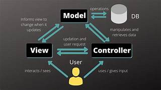

# Laporan Modul 1: Perkenalan Laravel
**Mata Kuliah:** Workshop Web Lanjut
**Nama:** Hafidz Maulana
**Nim:** 2024573010087
**Kelas:** TI 2C

---

## Abstrak
laporan ini membahas tentang pemahanan dasar dari salah satu framework php yang sering digunakan untuk mengembangkan sebuah web, yang dinamakan sebagai framework laravel, framework ini bersifat open source, yang artinya framework ini bisa di akses oleh semua orang.
Tujuan saya membuat laporan ini adalah agar saya bisa menyelesaikan tugas yang diberikan dan juga agar saya bisa pulang 

---

## 1. Pendahuluan
Laravel adalah framework aplikasi web berbasis php yang bersifat open source. Laravel dikembangkan oleh Taylor Otwell pada tahun 2011 dengan tujuan mempermudah developer dalam membangun aplikasi web yang cepat, aman, dan terstruktur

Laravel adalah salah satu framework php yang digunakan untuk mengembangkan sebuah web dan bersifat open source

## Karekteristik utama laravel

    1. MVC (Model View Controller) : memisahkan logika aplikasi, tampilan, dan pengelolaan data
    2. Opinionated Framework       : menyedikan aturan dan struktur tertentu
    3. Elegant Syntax              : sintaksis yang mudah dipahami dan konsisen
    4. Ekosistem luas              : menyediakan banyak paket dan fitur bawaan

Laravel cocok digunakan untuk aplikasi yang berbasis database (CRUD, e-commerce, sistem informasi, dan manajemen data), kemudian untuk API backend, dan aplikasi web skala kecil hingga besar dengan kebutuhan kompleks

---

## 2. Komponen Utama Laravel
    1. Blade (Templeting)   : Templeting bawaan laravel yang memisahkan tampilan logika
    2. Eloquent (ORM)       : Object Relational Mapping untuk berinteraksi dengan database
    3. Routing              : Mengatur rute URL dan menyambungkannya dengan controller
    4. Controller           : Logika operasi yang menangani request 
    5. Migrations & seeders : Migration untuk mengatur struktur database dan Seeders untuk mengisi data awal
    6. Artisan CLI          : Untuk mempermudah generated kode
    7. Testing (PHPUnit)    : Mendukung pengujian otomatis untuk memastikan aplikasi berjalan sesuai harapan

---

## 3. Struktur folder dan file laravel
    1. app/       : kode utama aplikasi (Model,Controller, Middleware)
    2. bootstrap/ : Menginisialisasi framework dan autoload
    3. config/    : file konfigurasi aplikasi
    4. database/  : migration, seeder, dan factory
    5. public/    : folder publik (index php, asset)
    6. resources/ : berisi view
    7. routes/    : file rute aplikasi 
    8. storage/   : file log, cache, session, dan file upload
    9. test/      : file pengujian unit fitur
    10. vendor/   : library dari composer

---

## 4. Diagram MVC dan cara kerjanya
## Diagram MVC menjelaskan alur kerja Laravel:
    1. Request dari user masuk melalui browser
    2. Routing menentukan controller yang sesuai 
    3. Controller memproses logika dan berinteraksi dengan Model jika perlu mengambil data 
    4. Model berkomunikasi dengan Database
    5. Data dikembalikan ke Controller, lalu dikirim ke View (Blade)
    6. View merender hasil dan dikembalikan sebagai Response ke browser

---

## 5. Kelebihan dan Kekurangan
## Kelebihan Laravel :
    1. sintaksi mudah dipahami 
    2. memiliki banyak fitur bawaan
    3. Ekosistem luas dan Komunitas besar
    4. Mendukung arsitektur modern

## Kekurangan Laravel :
    1. Struktur folder cukup banyak dan dapat membingungkan di awal bagi pemula
    2. Membutuhkan pemahanan dasar PHP dan OOP
    3. Peforma bisa lebih berat dibandingkan framework minialis

---

## 6. Referensi
    1. https://chatgpt.com/c/68bfdc15-c290-8326-a2d1-4eaef728f968
    2. Laravel Official Documentation — https://laravel.com/docs

---

