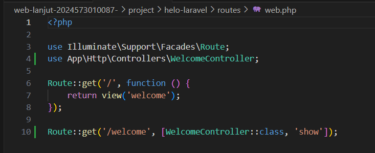
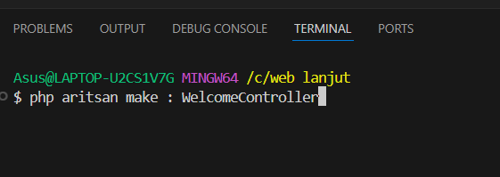
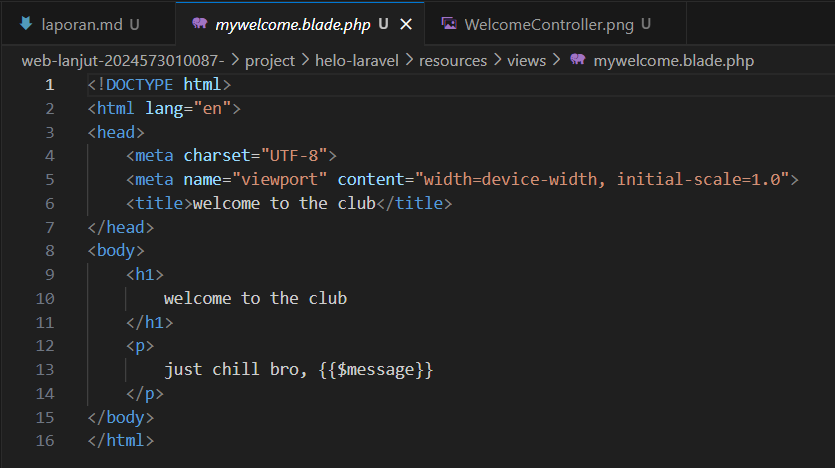
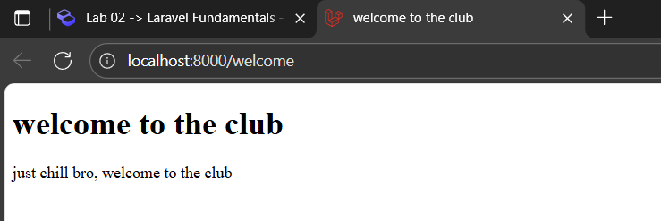
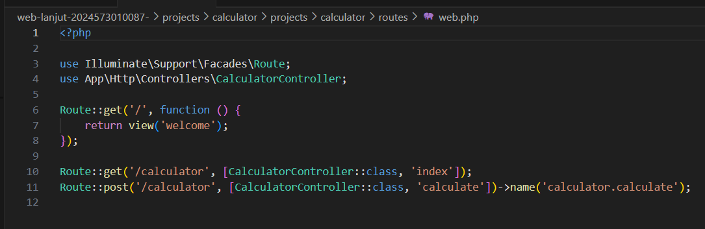
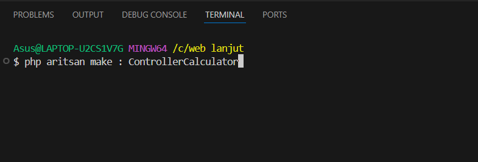
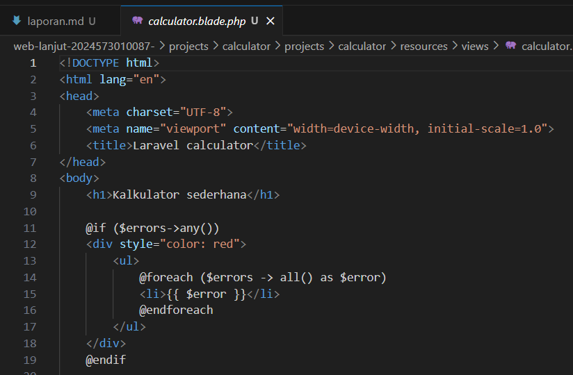
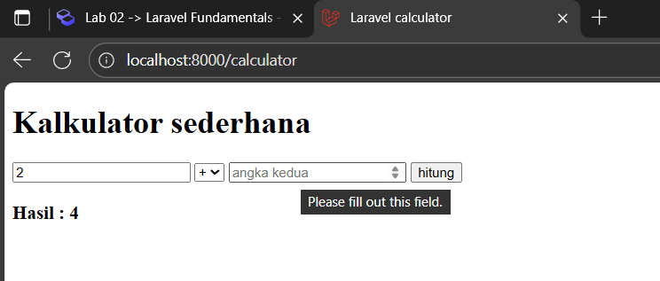

# Laporan Modul 2: Laravel Fundamental
**Mata Kuliah : **Workshop Web Lanjut
**Nama        : **Hafidz Maulana
**NIM         : **2024573010087
**Kelas       : **TI 2C

---

## Abstrak
Isi dari laporam ini sendiri adalah bagaimana cara membuat project kalkulator sederhana menggunakan framewrok laravel, nah project ini mempelajari bagaimana cara kerja route, controller, dan view, pertama tama route akan mendefinisikan URL yang akan mengarah ke controller, kemudian controller memproses logika perhitungan(kalkulator), dan view atau lebih tepatnya calculator.blade.php akan menampilkan form input 2 angka, opsi proses perhitungan yang ingin di lakukan dan hasil dari perhitungan yang dilakukan. Tujuan saya membuat laporan ini karena saya ingin mengetahui bagaimana cara kerja dari MVC untuk memproses perhitungan kalkulator dan juga agar bisa masuk kelas.

---

## 1. Dasar Teori
Apa itu MVC ?, MVC (model,view,control)
**model -> bagian yang bertugas untuk mengelola data dari database, pada bagian ini berisi logika pengolahan data seperti mengambil, menyimpan, merubah, dan menghapus
**view -> bagian yang bertugas sebagai tampilan website atau aplikasi. Data yang ditampilkan berupa HTML, JSON, XML
**control -> bagian yang bertugas sebagai penghubung antara model dan view, controller mendapat input dari pengguna melalui HTTP request, selanjutnya memproses input yang diterima tersebut dengan berintraksi dengan model, lalu mengembalikan hasilnya pada view untuk di tampilkan ke pengguna

**Konsep routing
Konsep routing. routing adalah mekanisme untuk menghubungkan URL (alamat yang diakses oleh pengguna) dengan logika program yang ada di aplikasi, di mana dari proses routing ini kita akan bisa memetakan dari dan harus kemana alur aplikasi laravel, 

## Fungsi routing
    1 . Mengarahkan Request – setiap request (GET, POST, PUT, DELETE) yang masuk akan diarahkan ke Controller atau Closure tertentu.
    2. Menentukan Response – routing bisa mengembalikan view, JSON, redirect, atau data lain.
    3. Mengatur Struktur URL – membuat URL yang rapi dan mudah dibaca.

## Fungsi middlaware
Middleware adalah lapisan perantara antara request (permintaan dari user/browser) dan aplikasi Laravel.
Setiap request yang masuk akan melewati middleware sebelum diteruskan ke route/controller. middleware biasa digunakan untuk menyebut sebuah perangkat lunak yang berperan sebagai "penengah" antara sebuah aplikasi dengan aplikasi lain untuk mempermudah proses integrasi antara aplikasi-aplikasi tersebut. Dalam konteks Laravel, Middleware merupakan sebuah Class khusus yang berperan sebagai "penengah" antara request yang masuk dengan Controller yang dituju. Secara umum, prinsip kerja Middleware adalah mencegat request yang masuk untuk kemudian diproses terlebih dahulu sebelum diberikan kepada Controller yang dituju atau diarahkan ke Controller yang lain. Dengan menggunakan fitur ini, kita dapat membuat komponen yang reusable untuk melakukan pekerjaan-pekerjaan tersebut.

## Fungsi utama middleware
    1. Autentikasi (Authentication)
       Memastikan user sudah login sebelum mengakses halaman tertentu.

    2. Otorisasi (Authorization)
       Mengecek apakah user punya hak akses untuk melakukan suatu aksi.

    3. Proteksi CSRF (Cross-Site Request Forgery)
       Middleware VerifyCsrfToken melindungi aplikasi dari serangan CSRF.

    4 .Manipulasi Request/Response
       Bisa digunakan untuk mengubah data request sebelum diteruskan ke controller
       atau memodifikasi response sebelum dikirim ke client.

    5. Logging dan Monitoring
       Bisa mencatat setiap request yang masuk (IP address, waktu, dll.) untuk keperluan audit.

## cara Laravel Menangani Request & Response

    1. User Mengirim Request
       User mengetik URL atau mengirim form di browser, kemudian browser mengirim HTTP Request ke server.

    2. Masuk ke public/index.php
    Semua request masuk melalui file ini, file ini adalah entry point aplikasi Laravel.

    3. Diteruskan ke HTTP Kernel (app/Http/Kernel.php)
    Kernel memuat semua konfigurasi awal aplikasi, dan kernel menyiapkan daftar global middleware.

    4. Melewati Middleware Global
    Request diperiksa/difilter, jika middleware memblokir request → Laravel mengirim response error dan jika lolos → request diteruskan ke router.

    5. Routing Mengecek URL dan Method
    Laravel mencari route yang sesuai di routes/web.php (atau routes/api.php). Jika ketemu → arahkan ke controller atau closure dan jika tidak ketemu → tampilkan 404 Not Found.

    6. Menjalankan Controller
    Controller menangani logika program. Bisa mengambil data dari database, melakukan perhitungan, atau validasi input.

    7. Mengembalikan Hasil ke View
    Jika controller mengembalikan view → Laravel merender file .blade.php menjadi HTML. Jika controller mengembalikan JSON → Laravel membuat JSON response atau bisa juga mengembalikan redirect ke halaman lain.

    8. Mengirim Response ke Browser
    Response dikirim balik ke user dan browser menampilkan halaman atau data sesuai hasil.

## Peran controller dan view
    1. controller -> controller adalah otak dari aplikasi atau bagian yang mengatur logika bisnis, yang dimana dia akan menerima request dari route, memproses data, mengatur alur aplikasi, dan mengirim data ke view untuk di tampilkan

    2. view -> view adalah wajah dari aplikasi atau bagian yang menampilkan hasi ke user/pengguna, yang dimana dia akan menampilkan data yang dikirim oleh controller, Menyediakan form input, tabel, atau tampilan lain untuk user, dan Mengatur tata letak (layout) dan desain (HTML + CSS).

## Fungsi blade templete engine
    1. Menyediakan cara menulis view yang bersih, cepat, dan terstruktur.
    2. Mendukung pewarisan template sehingga halaman lebih konsisten.
    3. Menyediakan kontrol alur (if, loop) yang lebih mudah dibaca.
    4. Menyederhanakan penggunaan data dari controller dan fitur Laravel lain (CSRF, route, include).
    5. Meningkatkan keamanan dengan auto-escape.

## Langkah langkah praktikum

**2.1 Praktikum 1 – Route, Controller, dan Blade View
    1. menambahkan route

    2. membuat file WelcomeController

    3. membuat view mywelcome.blade.php

    4. hasil pada browser

**2.2 Praktikum 2 – Membuat Aplikasi Sederhana "Calculator"
    1. menambahkan route untuk kalkulator.

    2. membuat contoller ControllerCalculator

    3. menambahkan view calculator.blade.php

    4. hasil pada browser

## Hasil dari pembahasan
    1. Apakah aplikasi berjalan sesuai harapan?, ya aplikasi berjalan sesuai harapan dan juga menghasilkan output yang sesuai
    2. Apa yang terjadi jika ada input yang salah (misalnya pembagian dengan 0)?, hasil akan memperlihatkan "error : division by 0"
    3. Bagaimana validasi input bekerja di Laravel?, cara pertama laravel akan mengecek apakah data yang diinput sesuai aturan, lalu jika data yang di inputkan tidak valid maka akan mengembalikkan error, dan terakhir data yang sudah di validasi akan dikirim ke controller

## peran dari masing-masing komponen (Route, Controller, View) dalam program
    1. route -> menghubungkan URL yang diketik atau yang diminta oleh user, kemudian route akan memanggil controller
    2. controller -> sebagai otak dari aplikasi, controller menerima URL dari request kemudian di proses, dan mengirimkannya ke view
    3. view -> menerima data dari controller dan menampilkannya ke pengguna atau user dalam bentuk HTML, JSON, atau XML

## Kesimpulan 
project ini bertujuan untuk memberi tahukan bagaimana cara kerja MVC (model, view, control), bagaimana cara MVC mengeksekusi sebuah program dan bagaimana cara menggunakan konsep dari arsitektur MVC dalam membuat sebuah web/aplikasi.

## Referensi
    1. https://id-laravel.com/post/middleware-manfaat-dan-penggunaannya/
    2. https://jagongoding.com/web/laravel/mari-mengenal-konsep-routing-pada-laravel/
    3. https://www.rumahweb.com/journal/belajar-laravel-bagian-3/

